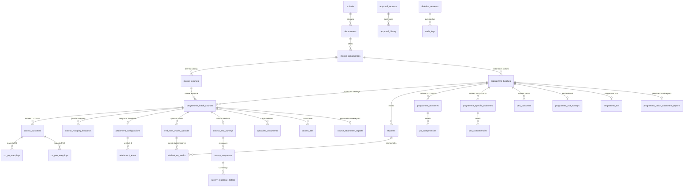

# DYPIU NBA Attainment System — Complete Database Schema (`schema.md`)

This document describes the complete PostgreSQL database schema for the **DYPIU NBA Attainment Backend**, including all tables, columns, primary/foreign keys, unique constraints, check constraints, indexes, and lifecycle status definitions across all database migrations (V1 to V6).

---

## 1. Domain Hierarchy & Entity Relationship Diagram

---

## 2. Table Specifications

### 2.1 Institutional & Academic Foundation

#### `schools`
Represents an academic school within the university (e.g., School of Engineering, School of Design).

| Column | Type | Constraints | Default | Description |
|---|---|---|---|---|
| `id` | VARCHAR(50) | PRIMARY KEY | | Unique School ID |
| `code` | VARCHAR(20) | NOT NULL, UNIQUE | | Unique School code (e.g., `SOE`) |
| `name` | VARCHAR(255) | NOT NULL | | Full name of the School |
| `director_id` | BIGINT | UNIQUE | NULL | User ID of the assigned Director |
| `director_name` | VARCHAR(255) | | NULL | Full name of Director |
| `director` | VARCHAR(150) | | NULL | Director identifier / display name |
| `director_email` | VARCHAR(150) | UNIQUE | NULL | Official Director email address |
| `est_year` | VARCHAR(10) | | NULL | Establishment year |
| `created_at` | TIMESTAMPTZ | | `CURRENT_TIMESTAMP` | Creation timestamp |
| `updated_at` | TIMESTAMPTZ | | `CURRENT_TIMESTAMP` | Last updated timestamp |

---

#### `departments`
Represents an academic department belonging to a school.

| Column | Type | Constraints | Default | Description |
|---|---|---|---|---|
| `id` | VARCHAR(50) | PRIMARY KEY | | Unique Department ID |
| `school_id` | VARCHAR(50) | NOT NULL, FK -> `schools(id)` ON DELETE CASCADE | | Owning School ID |
| `code` | VARCHAR(20) | NOT NULL | | Department code within school (e.g., `CSE`) |
| `name` | VARCHAR(255) | NOT NULL | | Department name |
| `hod` | VARCHAR(150) | | NULL | Name/display of Head of Department |
| `hod_email` | VARCHAR(150) | | NULL | Email of Head of Department |
| `status` | VARCHAR(20) | NOT NULL | `'ACTIVE'` | Status (`ACTIVE`, `INACTIVE`) |
| `created_at` | TIMESTAMPTZ | | `CURRENT_TIMESTAMP` | Creation timestamp |
| `updated_at` | TIMESTAMPTZ | | `CURRENT_TIMESTAMP` | Last updated timestamp |

- **Unique Constraints:** `uq_department_school_code (school_id, code)`
- **Indexes:** `idx_departments_school (school_id)`

---

#### `master_programmes`
Represents an academic degree programme (e.g., B.Tech CSE, MCA).

| Column | Type | Constraints | Default | Description |
|---|---|---|---|---|
| `id` | VARCHAR(50) | PRIMARY KEY | | Canonical Programme ID (e.g., `prog-btech-cse`) |
| `department_id` | VARCHAR(50) | NOT NULL, FK -> `departments(id)` ON DELETE CASCADE | | Owning Department ID |
| `code` | VARCHAR(20) | NOT NULL, UNIQUE | | Unique Programme Code (e.g., `BT-CSE`) |
| `name` | VARCHAR(255) | NOT NULL | | Full Programme Name |
| `duration_years`| INTEGER | NOT NULL | `4` | Programme duration in years |
| `department_name`| VARCHAR(255) | | NULL | Cached Department name |
| `status` | VARCHAR(20) | NOT NULL | `'ACTIVE'` | Status (`ACTIVE`, `INACTIVE`) |
| `created_at` | TIMESTAMPTZ | | `CURRENT_TIMESTAMP` | Creation timestamp |
| `updated_at` | TIMESTAMPTZ | | `CURRENT_TIMESTAMP` | Last updated timestamp |

- **Indexes:** `idx_master_programmes_department (department_id)`

---

#### `users`
Represents user accounts, system roles, and organizational access scoping.

| Column | Type | Constraints | Default | Description |
|---|---|---|---|---|
| `id` | BIGSERIAL | PRIMARY KEY | Generated | Internal User ID |
| `username` | VARCHAR(100) | NOT NULL, UNIQUE | | Login username |
| `email` | VARCHAR(150) | NOT NULL, UNIQUE | | Login email address |
| `password_hash` | VARCHAR(255) | NOT NULL | | BCrypt hashed password |
| `name` | VARCHAR(150) | NOT NULL | | Full user name |
| `role` | VARCHAR(50) | NOT NULL | | System role (e.g. `SUPER_ADMIN`, `DIRECTOR`, `HOD`, `PROGRAMME_COORDINATOR`, `COURSE_COORDINATOR`, `FACULTY`) |
| `department` | VARCHAR(255) | | NULL | Cached department name |
| `programme` | VARCHAR(255) | | NULL | Cached programme name |
| `school_id` | VARCHAR(50) | FK -> `schools(id)` ON DELETE SET NULL | NULL | Scoped School ID |
| `department_id` | VARCHAR(50) | FK -> `departments(id)` ON DELETE SET NULL | NULL | Scoped Department ID |
| `programme_id` | VARCHAR(50) | FK -> `master_programmes(id)` ON DELETE SET NULL | NULL | Scoped Programme ID |
| `is_active` | BOOLEAN | NOT NULL | `TRUE` | Account active flag |
| `created_at` | TIMESTAMPTZ | | `CURRENT_TIMESTAMP` | Creation timestamp |
| `updated_at` | TIMESTAMPTZ | | `CURRENT_TIMESTAMP` | Last updated timestamp |

- **Indexes:** `idx_users_username (username)`, `idx_users_email (email)`, `idx_users_scope (school_id, department_id, programme_id)`

---

### 2.2 Cohort, Catalog & Scheduling

#### `programme_batches`
Represents a specific student cohort admitting in a given year.

| Column | Type | Constraints | Default | Description |
|---|---|---|---|---|
| `id` | VARCHAR(50) | PRIMARY KEY | | Unique Batch ID (e.g., `batch-2022-2026`) |
| `master_programme_id` | VARCHAR(50) | NOT NULL, FK -> `master_programmes(id)` ON DELETE CASCADE | | Parent Master Programme ID |
| `name` | VARCHAR(255) | NOT NULL | | Batch Name (e.g., `2022-2026 Batch`) |
| `start_year` | INTEGER | NOT NULL | | Admission start year |
| `end_year` | INTEGER | NOT NULL | | Graduation end year |
| `duration_years`| INTEGER | NOT NULL | `4` | Cohort duration |
| `coordinator_id`| BIGINT | FK -> `users(id)` ON DELETE SET NULL | NULL | User ID of Programme Coordinator |
| `coordinator_name` | VARCHAR(150) | | NULL | Programme Coordinator name |
| `coordinator_email`| VARCHAR(150) | | NULL | Programme Coordinator email |
| `year_level` | VARCHAR(100) | | NULL | Academic year level |
| `status` | VARCHAR(20) | NOT NULL | `'ACTIVE'` | Batch lifecycle status (`ACTIVE`, `FINALIZED`, `GRADUATED`) |
| `editing_window_until` | TIMESTAMPTZ | | NULL | Expiry of temporary editing window for graduated batches |
| `editing_window_opened_at` | TIMESTAMPTZ | | NULL | When the editing window was opened |
| `editing_window_opened_by` | VARCHAR(150) | | NULL | Actor who opened the editing window |
| `deleted_at` | TIMESTAMPTZ | | NULL | Soft-deletion timestamp |
| `deleted_by` | VARCHAR(255) | | NULL | Actor who soft-deleted the batch |
| `created_at` | TIMESTAMPTZ | | `CURRENT_TIMESTAMP` | Creation timestamp |
| `updated_at` | TIMESTAMPTZ | | `CURRENT_TIMESTAMP` | Last updated timestamp |

- **Constraints:** `uk_programme_batch_start_year (master_programme_id, start_year)`, `chk_batch_year_range (end_year > start_year)`, `chk_batch_duration (end_year - start_year = duration_years)`
- **Indexes:** `idx_programme_batches_programme (master_programme_id)`, `idx_programme_batches_coordinator (coordinator_id)`, `idx_programme_batches_deleted (deleted_at)`

---

#### `semesters`
Semesters belonging to a specific programme batch.

| Column | Type | Constraints | Default | Description |
|---|---|---|---|---|
| `id` | VARCHAR(50) | PRIMARY KEY | | Semester identifier |
| `programme_batch_id` | VARCHAR(50) | NOT NULL, FK -> `programme_batches(id)` ON DELETE CASCADE | | Parent Batch ID |
| `semester_num` | INTEGER | NOT NULL | | Semester index (1-8) |
| `name` | VARCHAR(50) | NOT NULL | | Semester display name (e.g. `Semester 1`) |
| `status` | VARCHAR(20) | NOT NULL | `'ACTIVE'` | Status |
| `created_at` | TIMESTAMPTZ | | `CURRENT_TIMESTAMP` | Creation timestamp |

- **Constraints:** `uq_batch_semester (programme_batch_id, semester_num)`, `chk_semester_number (semester_num >= 1)`
- **Indexes:** `idx_semesters_batch (programme_batch_id)`

---

#### `master_courses`
Reusable master course definitions belonging to a master programme.

| Column | Type | Constraints | Default | Description |
|---|---|---|---|---|
| `id` | VARCHAR(50) | PRIMARY KEY | | Master Course ID (e.g., `course-cs301`) |
| `code` | VARCHAR(50) | NOT NULL | | Master course code (e.g., `CS301`) |
| `name` | VARCHAR(255) | NOT NULL | | Master course name |
| `master_programme_id` | VARCHAR(50) | NOT NULL, FK -> `master_programmes(id)` ON DELETE CASCADE | | Master Programme ID |
| `credits` | INTEGER | NOT NULL | `4` | Course credits |
| `course_type` | VARCHAR(50) | NOT NULL | `'CORE'` | Type (`CORE`, `ELECTIVE`, `LAB`, etc.) |
| `status` | VARCHAR(30) | NOT NULL | `'ACTIVE'` | Status (`ACTIVE`, `INACTIVE`) |
| `created_at` | TIMESTAMPTZ | | `CURRENT_TIMESTAMP` | Creation timestamp |
| `updated_at` | TIMESTAMPTZ | | `CURRENT_TIMESTAMP` | Last updated timestamp |

- **Constraints:** `uq_course_programme_code (master_programme_id, code)`
- **Indexes:** `idx_master_courses_programme (master_programme_id)`

---

#### `programme_batch_courses`
A batch-specific offering of a master course in a designated semester.

| Column | Type | Constraints | Default | Description |
|---|---|---|---|---|
| `id` | VARCHAR(50) | PRIMARY KEY | | Unique Course Offering ID (e.g., `pbc-2022-cs301`) |
| `master_course_id` | VARCHAR(50) | NOT NULL, FK -> `master_courses(id)` ON DELETE CASCADE | | Master Course Catalog ID |
| `programme_batch_id` | VARCHAR(50) | NOT NULL, FK -> `programme_batches(id)` ON DELETE CASCADE | | Programme Batch ID |
| `semester` | INTEGER | NOT NULL | | Semester number (1-8) |
| `course_code_override` | VARCHAR(50) | | NULL | Optional batch-specific code override |
| `course_name_override` | VARCHAR(255) | | NULL | Optional batch-specific name override |
| `course_coordinator_id` | BIGINT | FK -> `users(id)` ON DELETE SET NULL | NULL | User ID of Course Coordinator |
| `course_coordinator_name` | VARCHAR(255) | | NULL | Name of Course Coordinator |
| `assigned_faculty` | TEXT | | NULL | Comma-separated or JSON list of assigned faculty |
| `status` | VARCHAR(30) | NOT NULL | `'ACTIVE'` | Allocation/Course status |
| `deleted_at` | TIMESTAMPTZ | | NULL | Soft-deletion timestamp |
| `deleted_by` | VARCHAR(255) | | NULL | Actor who soft-deleted the course offering |
| `created_at` | TIMESTAMPTZ | | `CURRENT_TIMESTAMP` | Creation timestamp |
| `updated_at` | TIMESTAMPTZ | | `CURRENT_TIMESTAMP` | Last updated timestamp |

- **Constraints:** `uk_batch_course_sem (programme_batch_id, master_course_id, semester)`, `chk_offering_semester (semester >= 1)`
- **Indexes:** `idx_programme_batch_courses_batch (programme_batch_id)`, `idx_programme_batch_courses_course (master_course_id)`, `idx_programme_batch_courses_coordinator (course_coordinator_id)`, `idx_programme_batch_courses_deleted (deleted_at)`

---

#### `students`
Students enrolled in a specific batch cohort.

| Column | Type | Constraints | Default | Description |
|---|---|---|---|---|
| `id` | VARCHAR(50) | PRIMARY KEY | | Student Record ID |
| `programme_batch_id` | VARCHAR(50) | NOT NULL, FK -> `programme_batches(id)` ON DELETE CASCADE | | Programme Batch ID |
| `prn` | VARCHAR(50) | NOT NULL, UNIQUE | | Permanent Registration Number |
| `name` | VARCHAR(150) | NOT NULL | | Student full name |
| `email` | VARCHAR(150) | NOT NULL | | Student email |
| `status` | VARCHAR(20) | NOT NULL | `'ENROLLED'` | Student Status (`ENROLLED`, `GRADUATED`, etc.) |
| `created_at` | TIMESTAMPTZ | | `CURRENT_TIMESTAMP` | Creation timestamp |
| `updated_at` | TIMESTAMPTZ | | `CURRENT_TIMESTAMP` | Last updated timestamp |

- **Indexes:** `idx_students_batch (programme_batch_id)`

---

### 2.3 Outcome Hierarchy & Articulation Matrices

#### `programme_outcomes`
Batch-scoped Programme Outcomes (PO1 to PO12).

| Column | Type | Constraints | Default | Description |
|---|---|---|---|---|
| `id` | VARCHAR(50) | PRIMARY KEY | | PO Record ID |
| `programme_batch_id` | VARCHAR(50) | NOT NULL, FK -> `programme_batches(id)` ON DELETE CASCADE | | Programme Batch ID |
| `code` | VARCHAR(20) | NOT NULL | | PO Code (`PO1` - `PO12`) |
| `statement` | TEXT | NOT NULL | | Standard NBA PO statement |
| `target` | NUMERIC(4,2) | NOT NULL | `2.50` | Attainment Target level (0.00 - 3.00) |
| `status` | VARCHAR(30) | NOT NULL | `'DRAFT'` | Workflow status (`DRAFT`, `SUBMITTED`, `APPROVED`) |
| `created_at` | TIMESTAMPTZ | | `CURRENT_TIMESTAMP` | Creation timestamp |
| `updated_at` | TIMESTAMPTZ | | `CURRENT_TIMESTAMP` | Last updated timestamp |

- **Constraints:** `uk_batch_po_code (programme_batch_id, code)`, `chk_po_target (target >= 0 AND target <= 3)`
- **Indexes:** `idx_programme_outcomes_batch (programme_batch_id)`

---

#### `po_competencies`
Competencies and performance indicators under a Programme Outcome.

| Column | Type | Constraints | Default | Description |
|---|---|---|---|---|
| `id` | VARCHAR(50) | PRIMARY KEY | | Competency ID |
| `po_id` | VARCHAR(50) | NOT NULL, FK -> `programme_outcomes(id)` ON DELETE CASCADE | | Parent PO ID |
| `code` | VARCHAR(30) | NOT NULL | | Competency code (e.g. `PO1.1`) |
| `statement` | TEXT | NOT NULL | | Competency statement |
| `created_at` | TIMESTAMPTZ | | `CURRENT_TIMESTAMP` | Creation timestamp |

- **Constraints:** `uq_po_competency (po_id, code)`
- **Indexes:** `idx_po_competencies_po (po_id)`

---

#### `programme_specific_outcomes`
Batch-scoped Programme Specific Outcomes (PSO1 to PSO3).

| Column | Type | Constraints | Default | Description |
|---|---|---|---|---|
| `id` | VARCHAR(50) | PRIMARY KEY | | PSO Record ID |
| `programme_batch_id` | VARCHAR(50) | NOT NULL, FK -> `programme_batches(id)` ON DELETE CASCADE | | Programme Batch ID |
| `code` | VARCHAR(20) | NOT NULL | | PSO Code (`PSO1`, `PSO2`, `PSO3`) |
| `statement` | TEXT | NOT NULL | | Department-defined PSO statement |
| `target` | NUMERIC(4,2) | NOT NULL | `2.50` | Attainment Target level (0.00 - 3.00) |
| `status` | VARCHAR(30) | NOT NULL | `'DRAFT'` | Workflow status (`DRAFT`, `SUBMITTED`, `APPROVED`) |
| `created_at` | TIMESTAMPTZ | | `CURRENT_TIMESTAMP` | Creation timestamp |
| `updated_at` | TIMESTAMPTZ | | `CURRENT_TIMESTAMP` | Last updated timestamp |

- **Constraints:** `uk_batch_pso_code (programme_batch_id, code)`, `chk_pso_target (target >= 0 AND target <= 3)`
- **Indexes:** `idx_programme_pso_batch (programme_batch_id)`

---

#### `pso_competencies`
Competencies and performance indicators under a Programme Specific Outcome.

| Column | Type | Constraints | Default | Description |
|---|---|---|---|---|
| `id` | VARCHAR(50) | PRIMARY KEY | | Competency ID |
| `pso_id` | VARCHAR(50) | NOT NULL, FK -> `programme_specific_outcomes(id)` ON DELETE CASCADE | | Parent PSO ID |
| `code` | VARCHAR(30) | NOT NULL | | Competency code (e.g. `PSO1.1`) |
| `statement` | TEXT | NOT NULL | | Competency statement |
| `created_at` | TIMESTAMPTZ | | `CURRENT_TIMESTAMP` | Creation timestamp |

- **Constraints:** `uq_pso_competency (pso_id, code)`
- **Indexes:** `idx_pso_competencies_pso (pso_id)`

---

#### `peo_outcomes`
Program Educational Objectives (PEO1 to PEO4).

| Column | Type | Constraints | Default | Description |
|---|---|---|---|---|
| `id` | VARCHAR(50) | PRIMARY KEY | | PEO Record ID |
| `programme_batch_id` | VARCHAR(50) | NOT NULL, FK -> `programme_batches(id)` ON DELETE CASCADE | | Programme Batch ID |
| `code` | VARCHAR(20) | NOT NULL | | PEO Code (`PEO1`, etc.) |
| `statement` | TEXT | NOT NULL | | PEO statement |
| `status` | VARCHAR(30) | NOT NULL | `'DRAFT'` | Status |
| `created_at` | TIMESTAMPTZ | | `CURRENT_TIMESTAMP` | Creation timestamp |
| `updated_at` | TIMESTAMPTZ | | `CURRENT_TIMESTAMP` | Last updated timestamp |

- **Constraints:** `uk_batch_peo_code (programme_batch_id, code)`
- **Indexes:** `idx_peo_outcomes_batch (programme_batch_id)`

---

#### `course_outcomes`
Course Outcomes (CO1 to CO6) defined for a specific batch course offering.

| Column | Type | Constraints | Default | Description |
|---|---|---|---|---|
| `id` | VARCHAR(50) | PRIMARY KEY | | CO Record ID |
| `programme_batch_course_id` | VARCHAR(50) | NOT NULL, FK -> `programme_batch_courses(id)` ON DELETE CASCADE | | Course Offering ID |
| `code` | VARCHAR(30) | NOT NULL | | CO Code (`CO1` - `CO6`) |
| `statement` | TEXT | NOT NULL | | Course Outcome statement |
| `target_level` | NUMERIC(4,2) | NOT NULL | `2.50` | Attainment Target level (0.00 - 3.00) |
| `blooms_level` | VARCHAR(50) | | `'L3 - Apply'` | Bloom's Taxonomy Level |
| `status` | VARCHAR(30) | NOT NULL | `'DRAFT'` | Workflow status (`DRAFT`, `SUBMITTED`, `APPROVED`) |
| `created_at` | TIMESTAMPTZ | | `CURRENT_TIMESTAMP` | Creation timestamp |
| `updated_at` | TIMESTAMPTZ | | `CURRENT_TIMESTAMP` | Last updated timestamp |

- **Constraints:** `uk_batch_course_co_code (programme_batch_course_id, code)`, `chk_co_target_level (target_level >= 0 AND target_level <= 3)`
- **Indexes:** `idx_course_outcomes_batch_course (programme_batch_course_id)`

---

#### `co_po_mappings`
Table 1 Articulation matrix mapping a Course Outcome to a Programme Outcome (level 0 to 3).

| Column | Type | Constraints | Default | Description |
|---|---|---|---|---|
| `id` | VARCHAR(50) | PRIMARY KEY | | Mapping Record ID |
| `course_outcome_id` | VARCHAR(50) | NOT NULL, FK -> `course_outcomes(id)` ON DELETE CASCADE | | Course Outcome ID |
| `po_code` | VARCHAR(20) | NOT NULL | | Target PO Code (`PO1` - `PO12`) |
| `mapping_level` | INTEGER | NOT NULL | `0` | Correlation (0 = None, 1 = Low, 2 = Moderate, 3 = High) |
| `created_at` | TIMESTAMPTZ | | `CURRENT_TIMESTAMP` | Creation timestamp |
| `updated_at` | TIMESTAMPTZ | | `CURRENT_TIMESTAMP` | Last updated timestamp |

- **Constraints:** `uq_co_po (course_outcome_id, po_code)`, `chk_co_po_mapping_level (mapping_level BETWEEN 0 AND 3)`
- **Indexes:** `idx_co_po_mapping_co (course_outcome_id)`

---

#### `co_pso_mappings`
Table 1 Articulation matrix mapping a Course Outcome to a Programme Specific Outcome (level 0 to 3).

| Column | Type | Constraints | Default | Description |
|---|---|---|---|---|
| `id` | VARCHAR(50) | PRIMARY KEY | | Mapping Record ID |
| `course_outcome_id` | VARCHAR(50) | NOT NULL, FK -> `course_outcomes(id)` ON DELETE CASCADE | | Course Outcome ID |
| `pso_code` | VARCHAR(20) | NOT NULL | | Target PSO Code (`PSO1` - `PSO3`) |
| `mapping_level` | INTEGER | NOT NULL | `0` | Correlation (0 = None, 1 = Low, 2 = Moderate, 3 = High) |
| `created_at` | TIMESTAMPTZ | | `CURRENT_TIMESTAMP` | Creation timestamp |
| `updated_at` | TIMESTAMPTZ | | `CURRENT_TIMESTAMP` | Last updated timestamp |

- **Constraints:** `uq_co_pso (course_outcome_id, pso_code)`, `chk_co_pso_mapping_level (mapping_level BETWEEN 0 AND 3)`
- **Indexes:** `idx_co_pso_mapping_co (course_outcome_id)`

---

#### `course_mapping_keywords`
Keyword justifications explaining why specific CO-PO and CO-PSO mapping levels were assigned.

| Column | Type | Constraints | Default | Description |
|---|---|---|---|---|
| `id` | VARCHAR(50) | PRIMARY KEY | | Record ID |
| `programme_batch_course_id` | VARCHAR(50) | NOT NULL, FK -> `programme_batch_courses(id)` ON DELETE CASCADE | | Course Offering ID |
| `keyword_type` | VARCHAR(20) | NOT NULL | | Category (`PO` or `PSO`) |
| `keywords_json` | TEXT | NOT NULL | | JSON mapping matrix with justification keywords |
| `created_at` | TIMESTAMPTZ | | `CURRENT_TIMESTAMP` | Creation timestamp |
| `updated_at` | TIMESTAMPTZ | | `CURRENT_TIMESTAMP` | Last updated timestamp |

- **Constraints:** `uq_batch_course_keyword_type (programme_batch_course_id, keyword_type)`, `chk_keyword_type (keyword_type IN ('PO', 'PSO'))`
- **Indexes:** `idx_mapping_keywords_batch_course (programme_batch_course_id)`

---

### 2.4 Attainment Settings & Marks Ingestion

#### `attainment_configurations`
Attainment calculation weights and thresholds for a specific course offering.

| Column | Type | Constraints | Default | Description |
|---|---|---|---|---|
| `id` | VARCHAR(50) | PRIMARY KEY | | Config Record ID |
| `programme_batch_course_id` | VARCHAR(50) | NOT NULL, FK -> `programme_batch_courses(id)` ON DELETE CASCADE | | Course Offering ID |
| `direct_weight` | NUMERIC(5,2) | NOT NULL | `80.00` | Direct assessment weight % (default 80%) |
| `indirect_weight` | NUMERIC(5,2) | NOT NULL | `20.00` | Indirect survey weight % (default 20%) |
| `direct_threshold` | NUMERIC(5,2) | NOT NULL | `60.00` | Minimum score percentage to consider CO attained |
| `indirect_threshold` | NUMERIC(5,2) | NOT NULL | `60.00` | Minimum survey score percentage |
| `status` | VARCHAR(30) | NOT NULL | `'DRAFT'` | Workflow status |
| `submitted_by` | VARCHAR(150) | | NULL | Submitting user |
| `submitted_at` | TIMESTAMPTZ | | NULL | Submission timestamp |
| `direct_levels_json` | TEXT | | NULL | JSON representation of 3 direct attainment levels |
| `indirect_levels_json`| TEXT | | NULL | JSON representation of 3 indirect attainment levels |
| `created_at` | TIMESTAMPTZ | | `CURRENT_TIMESTAMP` | Creation timestamp |
| `updated_at` | TIMESTAMPTZ | | `CURRENT_TIMESTAMP` | Last updated timestamp |

- **Constraints:** `uq_attainment_config_batch_course (programme_batch_course_id)`
- **Indexes:** `idx_attainment_config_batch_course (programme_batch_course_id)`

---

#### `attainment_levels`
Discrete attainment levels (Level 1, 2, 3) mapped to student attainment percentage brackets.

| Column | Type | Constraints | Default | Description |
|---|---|---|---|---|
| `id` | VARCHAR(50) | PRIMARY KEY | | Level Record ID |
| `config_id` | VARCHAR(50) | NOT NULL, FK -> `attainment_configurations(id)` ON DELETE CASCADE | | Attainment Config ID |
| `type` | VARCHAR(20) | NOT NULL | | Assessment type (`DIRECT`, `INDIRECT`) |
| `level_val` | INTEGER | NOT NULL | | Attainment level (1, 2, or 3) |
| `min_percentage` | NUMERIC(5,2) | NOT NULL | | Minimum percentage threshold |
| `max_percentage` | NUMERIC(5,2) | NOT NULL | | Maximum percentage threshold |
| `created_at` | TIMESTAMPTZ | | `CURRENT_TIMESTAMP` | Creation timestamp |

- **Constraints:** `chk_attainment_level_type (type IN ('DIRECT', 'INDIRECT'))`, `chk_attainment_level_value (level_val BETWEEN 1 AND 3)`, `chk_attainment_percentage_range (min_percentage >= 0 AND max_percentage <= 100 AND max_percentage >= min_percentage)`, `uq_attainment_level (config_id, type, level_val)`

---

#### `end_sem_marks_uploads`
Metadata tracking uploaded Excel files containing semester student marks.

| Column | Type | Constraints | Default | Description |
|---|---|---|---|---|
| `id` | VARCHAR(50) | PRIMARY KEY | | Upload Record ID |
| `programme_batch_course_id` | VARCHAR(50) | NOT NULL, FK -> `programme_batch_courses(id)` ON DELETE CASCADE | | Course Offering ID |
| `file_name` | VARCHAR(255) | NOT NULL | | Original file name |
| `file_path` | VARCHAR(500) | NOT NULL | | Storage path on disk |
| `uploaded_by` | VARCHAR(150) | NOT NULL | | Uploader user |
| `uploaded_at` | TIMESTAMPTZ | | `CURRENT_TIMESTAMP` | Upload timestamp |
| `record_count` | INTEGER | | `0` | Number of student records processed |
| `status` | VARCHAR(30) | NOT NULL | `'COMPLETED'` | Status (`COMPLETED`, `FAILED`) |

- **Indexes:** `idx_marks_upload_batch_course (programme_batch_course_id)`

---

#### `student_co_marks`
Individual student scores obtained per Course Outcome in direct assessments.

| Column | Type | Constraints | Default | Description |
|---|---|---|---|---|
| `id` | VARCHAR(50) | PRIMARY KEY | | Mark Record ID |
| `upload_id` | VARCHAR(50) | FK -> `end_sem_marks_uploads(id)` ON DELETE CASCADE | NULL | Associated Marks Upload ID |
| `programme_batch_course_id` | VARCHAR(50) | NOT NULL, FK -> `programme_batch_courses(id)` ON DELETE CASCADE | | Course Offering ID |
| `student_id` | VARCHAR(50) | NOT NULL, FK -> `students(id)` ON DELETE CASCADE | | Student ID |
| `prn` | VARCHAR(50) | NOT NULL | | Student PRN |
| `student_name` | VARCHAR(150) | | NULL | Student Name |
| `co_code` | VARCHAR(30) | NOT NULL | | Evaluated CO (`CO1` - `CO6`) |
| `marks_obtained` | NUMERIC(8,2) | NOT NULL | | Marks scored by student |
| `max_marks` | NUMERIC(8,2) | NOT NULL | `100.00` | Maximum marks possible |
| `percentage` | NUMERIC(5,2) | | NULL | Computed score % |
| `created_at` | TIMESTAMPTZ | | `CURRENT_TIMESTAMP` | Timestamp |

- **Constraints:** `uq_student_co_mark (programme_batch_course_id, student_id, co_code)`
- **Indexes:** `idx_student_co_marks_batch_course (programme_batch_course_id)`, `idx_student_co_marks_student (student_id)`

---

### 2.5 Surveys & Document Evidence

#### `course_end_surveys`
Course End Survey metadata for indirect course outcome feedback.

| Column | Type | Constraints | Default | Description |
|---|---|---|---|---|
| `id` | VARCHAR(50) | PRIMARY KEY | | Survey Record ID |
| `programme_batch_course_id` | VARCHAR(50) | NOT NULL, FK -> `programme_batch_courses(id)` ON DELETE CASCADE | | Course Offering ID |
| `total_respondents` | INTEGER | | `0` | Number of participating students |
| `created_at` | TIMESTAMPTZ | | `CURRENT_TIMESTAMP` | Timestamp |

- **Constraints:** `uq_course_end_survey (programme_batch_course_id)`
- **Indexes:** `idx_course_surveys_batch_course (programme_batch_course_id)`

---

#### `survey_responses`
Student survey submission envelope.

| Column | Type | Constraints | Default | Description |
|---|---|---|---|---|
| `id` | VARCHAR(50) | PRIMARY KEY | | Response Envelope ID |
| `survey_id` | VARCHAR(50) | NOT NULL, FK -> `course_end_surveys(id)` ON DELETE CASCADE | | Parent Survey ID |
| `student_id` | VARCHAR(50) | FK -> `students(id)` ON DELETE SET NULL | NULL | Responding Student ID |
| `prn` | VARCHAR(50) | | NULL | Student PRN |
| `submitted_at` | TIMESTAMPTZ | | `CURRENT_TIMESTAMP` | Submission timestamp |

---

#### `survey_response_details`
Individual rating given by a student for a specific CO in a course end survey.

| Column | Type | Constraints | Default | Description |
|---|---|---|---|---|
| `id` | VARCHAR(50) | PRIMARY KEY | | Detail Record ID |
| `response_id` | VARCHAR(50) | NOT NULL, FK -> `survey_responses(id)` ON DELETE CASCADE | | Response Envelope ID |
| `co_code` | VARCHAR(30) | NOT NULL | | Rated CO code |
| `rating` | INTEGER | NOT NULL | | Survey rating (1 = Slight, 2 = Moderate, 3 = Substantial) |
| `created_at` | TIMESTAMPTZ | | `CURRENT_TIMESTAMP` | Timestamp |

- **Constraints:** `chk_survey_rating (rating BETWEEN 1 AND 3)`

---

#### `programme_exit_surveys`
Batch-level Programme Exit Survey results used for Indirect PO/PSO attainment (Report 3).

| Column | Type | Constraints | Default | Description |
|---|---|---|---|---|
| `id` | VARCHAR(50) | PRIMARY KEY | | Exit Survey ID |
| `programme_batch_id` | VARCHAR(50) | NOT NULL, FK -> `programme_batches(id)` ON DELETE CASCADE | | Programme Batch ID |
| `total_respondents` | INTEGER | | `0` | Total graduating respondents |
| `avg_exit_score` | NUMERIC(4,2) | | `2.50` | Average exit score |
| `created_at` | TIMESTAMPTZ | | `CURRENT_TIMESTAMP` | Timestamp |

- **Constraints:** `uq_programme_exit_survey (programme_batch_id)`
- **Indexes:** `idx_programme_exit_survey_batch (programme_batch_id)`

---

#### `uploaded_documents`
Uploaded supporting documents and files (syllabus, matrices, question papers, rubric evidence).

| Column | Type | Constraints | Default | Description |
|---|---|---|---|---|
| `id` | VARCHAR(255) | PRIMARY KEY | | Unique Document ID |
| `programme_batch_id` | VARCHAR(50) | NOT NULL, FK -> `programme_batches(id)` ON DELETE CASCADE | | Programme Batch ID |
| `programme_batch_course_id`| VARCHAR(50) | FK -> `programme_batch_courses(id)` ON DELETE CASCADE | NULL | Optional Course Offering ID |
| `document_type` | VARCHAR(50) | NOT NULL | | Document category enum |
| `file_name` | VARCHAR(255) | NOT NULL | | Original file name |
| `saved_file_name` | VARCHAR(255) | NOT NULL | | Disk file name |
| `saved_path` | VARCHAR(500) | NOT NULL | | Storage location path |
| `file_size` | BIGINT | | NULL | File size in bytes |
| `records_processed` | INTEGER | | NULL | Ingested record count |
| `threshold_percentage` | NUMERIC(5,2)| | NULL | Ingestion threshold |
| `uploaded_by` | VARCHAR(150) | | NULL | Uploading user |
| `uploaded_at` | TIMESTAMPTZ | | `CURRENT_TIMESTAMP` | Upload timestamp |

- **Indexes:** `idx_uploaded_docs_batch (programme_batch_id)`, `idx_uploaded_docs_batch_course (programme_batch_course_id)`

---

### 2.6 Action Taken Reports (ATR)

#### `course_atrs`
Course Action Taken Report comparing CO target vs actual final attainment and recording continuous improvement actions.

| Column | Type | Constraints | Default | Description |
|---|---|---|---|---|
| `id` | VARCHAR(50) | PRIMARY KEY | | ATR Record ID |
| `programme_batch_course_id` | VARCHAR(50) | NOT NULL, FK -> `programme_batch_courses(id)` ON DELETE CASCADE | | Course Offering ID |
| `co_code` | VARCHAR(30) | NOT NULL | | Evaluated CO code |
| `title` | VARCHAR(255) | | NULL | ATR Title |
| `target_score` | NUMERIC(4,2) | NOT NULL | | Configured Target Score (e.g. 2.50) |
| `actual_score` | NUMERIC(4,2) | NOT NULL | | Computed Final CO Attainment |
| `pct_achieved` | NUMERIC(5,2) | NOT NULL | | Achievement % (`actual / target * 100`) |
| `status` | VARCHAR(50) | NOT NULL | `'DRAFT'` | Status (`DRAFT`, `SUBMITTED`, `VERIFIED`, `APPROVED`) |
| `statement` | TEXT | | NULL | Evaluated CO Statement |
| `actions_json` | TEXT | | NULL | Corrective action items JSON array |
| `submitted_by` | VARCHAR(150) | | NULL | Submitting Course Coordinator |
| `submitted_at` | TIMESTAMPTZ | | NULL | Submission timestamp |
| `verification_comments` | TEXT | | NULL | Comments from Programme Coordinator review |
| `verified_at` | TIMESTAMPTZ | | NULL | Verification timestamp |
| `verified_by` | VARCHAR(150) | | NULL | Reviewing Programme Coordinator |
| `created_at` | TIMESTAMPTZ | | `CURRENT_TIMESTAMP` | Creation timestamp |
| `updated_at` | TIMESTAMPTZ | | `CURRENT_TIMESTAMP` | Last updated timestamp |

- **Constraints:** `uk_batch_course_co_atr (programme_batch_course_id, co_code)`
- **Indexes:** `idx_course_atr_batch_course (programme_batch_course_id)`

---

#### `programme_atrs`
Programme Action Taken Report assessing batch-level PO/PSO attainment against targets with corrective actions.

| Column | Type | Constraints | Default | Description |
|---|---|---|---|---|
| `id` | VARCHAR(50) | PRIMARY KEY | | Programme ATR Record ID |
| `programme_batch_id` | VARCHAR(50) | NOT NULL, FK -> `programme_batches(id)` ON DELETE CASCADE | | Programme Batch ID |
| `status` | VARCHAR(30) | NOT NULL | `'DRAFT'` | Status (`DRAFT`, `SUBMITTED`, `VERIFIED`, `APPROVED`) |
| `submitted_by` | VARCHAR(150) | | NULL | Submitting Programme Coordinator |
| `submitted_at` | TIMESTAMPTZ | | NULL | Submission timestamp |
| `approved_by` | VARCHAR(150) | | NULL | Approving HOD / Director |
| `approved_at` | TIMESTAMPTZ | | NULL | Approval timestamp |
| `verified_by` | VARCHAR(150) | | NULL | Verifying reviewer |
| `verified_at` | TIMESTAMPTZ | | NULL | Verification timestamp |
| `verification_comments` | TEXT | | NULL | Reviewer comments |
| `observations_json` | TEXT | | NULL | JSON array containing PO/PSO observations & actions |
| `created_at` | TIMESTAMPTZ | | `CURRENT_TIMESTAMP` | Creation timestamp |
| `updated_at` | TIMESTAMPTZ | | `CURRENT_TIMESTAMP` | Last updated timestamp |

- **Constraints:** `uk_programme_batch_atr (programme_batch_id)`
- **Indexes:** `idx_programme_atr_batch (programme_batch_id)`

---

### 2.7 Attainment Reports Snapshots (Phase 10 / V6)

#### `course_attainment_reports`
Persisted snapshot of Course Attainment Tables 1, 2, and 3.

| Column | Type | Constraints | Default | Description |
|---|---|---|---|---|
| `id` | VARCHAR(50) | PRIMARY KEY | | Course Report ID (`courseAttainmentReportId`) |
| `programme_batch_course_id` | VARCHAR(50) | NOT NULL, FK -> `programme_batch_courses(id)` ON DELETE CASCADE | | Course Offering ID |
| `status` | VARCHAR(30) | NOT NULL | `'DRAFT'` | Report Status (`DRAFT`, `FINALIZED`) |
| `overall_co_attainment` | NUMERIC(5,2) | | NULL | Overall Course CO attainment score |
| `direct_attainment` | NUMERIC(5,2) | | NULL | Direct course assessment component |
| `indirect_attainment` | NUMERIC(5,2) | | NULL | Indirect course survey component |
| `table1_mapping_json` | TEXT | | NULL | Persisted Table 1 Articulation Matrix JSON |
| `table2_direct_json` | TEXT | | NULL | Persisted Table 2 PO/PSO Direct Contributions JSON (`{"po": [...], "pso": [...]}`) |
| `table3_co_attainment_json` | TEXT | | NULL | Persisted Table 3 Final CO Attainment JSON |
| `submitted_by` | VARCHAR(150) | | NULL | Submitting Course Coordinator |
| `submitted_at` | TIMESTAMPTZ | | NULL | Submission timestamp |
| `verified_by` | VARCHAR(150) | | NULL | Reviewer identifier |
| `verified_at` | TIMESTAMPTZ | | NULL | Verification timestamp |
| `approved_by` | VARCHAR(150) | | NULL | Approving authority |
| `approved_at` | TIMESTAMPTZ | | NULL | Approval timestamp |
| `created_at` | TIMESTAMPTZ | | `CURRENT_TIMESTAMP` | Creation timestamp |
| `updated_at` | TIMESTAMPTZ | | `CURRENT_TIMESTAMP` | Last updated timestamp |

- **Constraints:** `uk_course_attainment_report (programme_batch_course_id)`
- **Indexes:** `idx_course_attainment_report_offering (programme_batch_course_id)`

---

#### `programme_batch_attainment_reports`
Persisted snapshot of Programme Batch Reports 1, 2, 3, and 4.

| Column | Type | Constraints | Default | Description |
|---|---|---|---|---|
| `id` | VARCHAR(50) | PRIMARY KEY | | Programme Report ID (`programmeBatchAttainmentReportId`) |
| `programme_batch_id` | VARCHAR(50) | NOT NULL, FK -> `programme_batches(id)` ON DELETE CASCADE | | Programme Batch ID |
| `status` | VARCHAR(30) | NOT NULL | `'DRAFT'` | Report Status (`DRAFT`, `FINALIZED`) |
| `overall_programme_attainment` | NUMERIC(5,2) | | NULL | Final overall programme attainment average |
| `average_mapping_report_json` | TEXT | | NULL | Persisted Report 1 Average Mapping JSON (`{"po": [...], "pso": [...]}`) |
| `direct_attainment_report_json` | TEXT | | NULL | Persisted Report 2 Direct PO/PSO Attainment JSON (`{"po": [...], "pso": [...]}`) |
| `indirect_attainment_report_json`| TEXT | | NULL | Persisted Report 3 Exit Survey PO/PSO Attainment JSON (`{"po": [...], "pso": [...]}`) |
| `overall_attainment_report_json` | TEXT | | NULL | Persisted Report 4 Final 80/20 Attainment JSON (`{"po": [...], "pso": [...]}`) |
| `submitted_by` | VARCHAR(150) | | NULL | Submitting Programme Coordinator |
| `submitted_at` | TIMESTAMPTZ | | NULL | Submission timestamp |
| `approved_by` | VARCHAR(150) | | NULL | Approving authority |
| `approved_at` | TIMESTAMPTZ | | NULL | Approval timestamp |
| `created_at` | TIMESTAMPTZ | | `CURRENT_TIMESTAMP` | Creation timestamp |
| `updated_at` | TIMESTAMPTZ | | `CURRENT_TIMESTAMP` | Last updated timestamp |

- **Constraints:** `uk_programme_batch_attainment_report (programme_batch_id)`
- **Indexes:** `idx_programme_batch_attainment_report_batch (programme_batch_id)`

---

### 2.8 Governance, Approvals, Deletions & Auditing

#### `approval_requests`
Centralized approval engine routing requests across hierarchical roles.

| Column | Type | Constraints | Default | Description |
|---|---|---|---|---|
| `id` | VARCHAR(50) | PRIMARY KEY | | Approval Request ID (`approvalRequestId`) |
| `type` | VARCHAR(50) | NOT NULL | | Approval Type (e.g. `COURSE_OUTCOMES`, `PO_PSO_TARGETS`, `ALLOCATION`, etc.) |
| `title` | VARCHAR(255) | NOT NULL | | Human readable approval title |
| `resource_id` | VARCHAR(50) | NOT NULL | | ID of target entity under review |
| `school_id` | VARCHAR(50) | FK -> `schools(id)` ON DELETE CASCADE | NULL | Scoped School ID |
| `department_id` | VARCHAR(50) | FK -> `departments(id)` ON DELETE CASCADE | NULL | Scoped Department ID |
| `master_programme_id` | VARCHAR(50) | FK -> `master_programmes(id)` ON DELETE CASCADE | NULL | Scoped Master Programme ID |
| `programme_batch_id` | VARCHAR(50) | FK -> `programme_batches(id)` ON DELETE CASCADE | NULL | Scoped Programme Batch ID |
| `master_course_id` | VARCHAR(50) | FK -> `master_courses(id)` ON DELETE CASCADE | NULL | Scoped Master Course ID |
| `programme_batch_course_id`| VARCHAR(50) | FK -> `programme_batch_courses(id)` ON DELETE CASCADE | NULL | Scoped Course Offering ID |
| `submitted_by` | VARCHAR(150) | NOT NULL | | Submitting user name |
| `submitted_at` | TIMESTAMPTZ | | `CURRENT_TIMESTAMP` | Timestamp |
| `status` | VARCHAR(30) | NOT NULL | `'PENDING'` | Status (`PENDING`, `APPROVED`, `REJECTED`, `REVISION_REQUESTED`) |
| `approved_by` | VARCHAR(150) | | NULL | Approver user name |
| `approved_at` | TIMESTAMPTZ | | NULL | Approval timestamp |
| `remarks` | TEXT | | NULL | Approval or rejection remarks |
| `details` | TEXT | | NULL | JSON serialized snapshot of payload |
| `created_at` | TIMESTAMPTZ | | `CURRENT_TIMESTAMP` | Creation timestamp |
| `updated_at` | TIMESTAMPTZ | | `CURRENT_TIMESTAMP` | Last updated timestamp |

- **Indexes:** `idx_approval_requests_status (status)`, `idx_approval_requests_resource (resource_id)`, `idx_approval_requests_batch (programme_batch_id)`, `idx_approval_requests_batch_course (programme_batch_course_id)`

---

#### `approval_history`
Immutable review trail of every approval action.

| Column | Type | Constraints | Default | Description |
|---|---|---|---|---|
| `id` | VARCHAR(50) | PRIMARY KEY | | History Record ID |
| `approval_request_id` | VARCHAR(50) | NOT NULL, FK -> `approval_requests(id)` ON DELETE CASCADE | | Parent Approval Request ID |
| `actor_id` | BIGINT | FK -> `users(id)` ON DELETE SET NULL | NULL | User ID of reviewer |
| `actor_name` | VARCHAR(150) | NOT NULL | | Reviewer name |
| `actor_role` | VARCHAR(50) | NOT NULL | | Reviewer role |
| `action` | VARCHAR(50) | NOT NULL | | Action taken (`SUBMIT`, `APPROVE`, `REJECT`, `REQUEST_REVISION`) |
| `comments` | TEXT | | NULL | Review comments |
| `timestamp` | TIMESTAMPTZ | | `CURRENT_TIMESTAMP` | Timestamp |

- **Indexes:** `idx_approval_history_request (approval_request_id)`

---

#### `deletion_requests`
Two-man rule deletion request engine for major entities.

| Column | Type | Constraints | Default | Description |
|---|---|---|---|---|
| `id` | BIGINT | GENERATED AS IDENTITY PRIMARY KEY | Generated | Deletion Request ID (`deletionRequestId`) |
| `resource_type` | VARCHAR(100) | NOT NULL | | Target entity type (`PROGRAMME_BATCH`, `PROGRAMME_BATCH_COURSE`, etc.) |
| `resource_id` | VARCHAR(255) | NOT NULL | | Target entity identifier |
| `programme_batch_id` | VARCHAR(100) | | NULL | Scoped Programme Batch ID |
| `programme_batch_course_id`| VARCHAR(100) | | NULL | Scoped Course Offering ID |
| `master_programme_id` | VARCHAR(100) | | NULL | Scoped Master Programme ID |
| `department_id` | VARCHAR(100) | | NULL | Scoped Department ID |
| `school_id` | VARCHAR(100) | | NULL | Scoped School ID |
| `status` | VARCHAR(50) | NOT NULL | `'PENDING'` | Status (`PENDING`, `APPROVED`, `REJECTED`) |
| `requested_by` | VARCHAR(255) | | NULL | Submitting user name |
| `requested_by_id` | VARCHAR(100) | | NULL | Submitting user ID |
| `requested_by_role` | VARCHAR(50) | | NULL | Submitting user role |
| `requested_at` | TIMESTAMPTZ | NOT NULL | `CURRENT_TIMESTAMP` | Submission timestamp |
| `reviewed_by` | VARCHAR(255) | | NULL | Reviewing authority name |
| `reviewed_by_id` | VARCHAR(100) | | NULL | Reviewing authority ID |
| `reviewed_by_role` | VARCHAR(50) | | NULL | Reviewing authority role |
| `reviewed_at` | TIMESTAMPTZ | | NULL | Review timestamp |
| `executed_at` | TIMESTAMPTZ | | NULL | Execution timestamp |
| `remarks` | TEXT | | NULL | Submission reason/remarks |
| `rejection_reason` | TEXT | | NULL | Reason for rejection |
| `created_at` | TIMESTAMPTZ | NOT NULL | `CURRENT_TIMESTAMP` | Creation timestamp |
| `updated_at` | TIMESTAMPTZ | NOT NULL | `CURRENT_TIMESTAMP` | Last updated timestamp |

- **Indexes:** `idx_deletion_requests_resource (resource_type, resource_id)`, `idx_deletion_requests_status (status)`, `idx_deletion_requests_scope (school_id, department_id, master_programme_id)`

---

#### `audit_logs`
Centralized, immutable audit trail recording every state change, security event, and data modification.

| Column | Type | Constraints | Default | Description |
|---|---|---|---|---|
| `id` | BIGINT | GENERATED AS IDENTITY PRIMARY KEY | Generated | Audit Log ID (`auditLogId`) |
| `actor_id` | VARCHAR(100) | | NULL | User ID of the actor |
| `actor_role` | VARCHAR(50) | | NULL | Role of the actor |
| `actor_name` | VARCHAR(255) | | NULL | Full name of the actor |
| `actor_email` | VARCHAR(255) | | NULL | Email address of the actor |
| `action` | VARCHAR(100) | NOT NULL | | Action performed (e.g. `SUBMIT`, `APPROVE`, `REVISE`, `DELETE`, `LOGIN`) |
| `resource_type` | VARCHAR(100) | NOT NULL | | Resource type (e.g. `COURSE_OUTCOME`, `COURSE_ATTAINMENT`, etc.) |
| `resource_id` | VARCHAR(255) | | NULL | Identifier of affected resource |
| `old_status` | VARCHAR(50) | | NULL | Previous state value |
| `new_status` | VARCHAR(50) | | NULL | New state value |
| `remarks` | TEXT | | NULL | Human-readable explanation |
| `metadata` | TEXT | | NULL | Extended JSON metadata payload |
| `success` | BOOLEAN | NOT NULL | `TRUE` | Whether the action succeeded |
| `ip_address` | VARCHAR(100) | | NULL | Client IP address |
| `user_agent` | VARCHAR(500) | | NULL | Client HTTP User-Agent |
| `created_at` | TIMESTAMPTZ | NOT NULL | `CURRENT_TIMESTAMP` | Timestamp of the event |

- **Indexes:** `idx_audit_logs_actor (actor_id)`, `idx_audit_logs_action (action)`, `idx_audit_logs_resource (resource_type, resource_id)`, `idx_audit_logs_created_at (created_at)`

---

### 2.9 Wizard Setup Progress Tracking

#### `director_setup_progress`
Tracks onboarding setup progress for School Directors.

| Column | Type | Constraints | Default | Description |
|---|---|---|---|---|
| `id` | VARCHAR(50) | PRIMARY KEY | | Progress Record ID |
| `school_id` | VARCHAR(50) | NOT NULL, UNIQUE, FK -> `schools(id)` ON DELETE CASCADE | | Scoped School ID |
| `current_step` | INTEGER | NOT NULL | `1` | Step index (1-4) |
| `current_step_enum` | VARCHAR(30) | NOT NULL | `'SCHOOL'` | Current Step (`SCHOOL`, `DEPARTMENT`, `PROGRAMME`, `REVIEW`) |
| `overall_status` | VARCHAR(30) | NOT NULL | `'IN_PROGRESS'` | Status (`IN_PROGRESS`, `COMPLETED`) |
| `completed_steps` | VARCHAR(500) | | `''` | Comma-delimited list of completed step keys |
| `pending_steps` | VARCHAR(500) | | `'school,department,programme,review'` | Comma-delimited list of pending steps |
| `updated_at` | TIMESTAMPTZ | | `CURRENT_TIMESTAMP` | Last updated timestamp |

---

#### `hod_setup_progress`
Tracks onboarding setup progress for Heads of Departments.

| Column | Type | Constraints | Default | Description |
|---|---|---|---|---|
| `id` | VARCHAR(50) | PRIMARY KEY | | Progress Record ID |
| `department_id` | VARCHAR(50) | NOT NULL, UNIQUE, FK -> `departments(id)` ON DELETE CASCADE | | Scoped Department ID |
| `hod_email` | VARCHAR(150) | | NULL | HOD Email |
| `current_step` | INTEGER | NOT NULL | `1` | Step index (1-4) |
| `overall_status` | VARCHAR(30) | NOT NULL | `'IN_PROGRESS'` | Status (`IN_PROGRESS`, `COMPLETED`) |
| `completed_steps` | VARCHAR(500) | | `''` | Comma-delimited completed steps |
| `pending_steps` | VARCHAR(500) | | `'batch,outcomes,coordinators,review'` | Comma-delimited pending steps |
| `updated_at` | TIMESTAMPTZ | | `CURRENT_TIMESTAMP` | Last updated timestamp |

---

#### `pc_setup_progress`
Tracks onboarding setup progress for Programme Coordinators.

| Column | Type | Constraints | Default | Description |
|---|---|---|---|---|
| `id` | VARCHAR(50) | PRIMARY KEY | | Progress Record ID |
| `programme_batch_id` | VARCHAR(50) | NOT NULL, UNIQUE, FK -> `programme_batches(id)` ON DELETE CASCADE | | Scoped Programme Batch ID |
| `coordinator_email` | VARCHAR(150) | | NULL | PC Email |
| `current_step` | INTEGER | NOT NULL | `1` | Step index (1-3) |
| `overall_status` | VARCHAR(50) | NOT NULL | `'IN_PROGRESS'` | Status (`IN_PROGRESS`, `COMPLETED`) |
| `completed_steps` | VARCHAR(500) | | `''` | Comma-delimited completed steps |
| `pending_steps` | VARCHAR(500) | | `'courses,targets,review'` | Comma-delimited pending steps |
| `updated_at` | TIMESTAMPTZ | | `CURRENT_TIMESTAMP` | Last updated timestamp |

---

#### `cc_setup_progress`
Tracks onboarding setup progress for Course Coordinators.

| Column | Type | Constraints | Default | Description |
|---|---|---|---|---|
| `id` | VARCHAR(50) | PRIMARY KEY | | Progress Record ID |
| `programme_batch_course_id` | VARCHAR(50) | NOT NULL, UNIQUE, FK -> `programme_batch_courses(id)` ON DELETE CASCADE | | Scoped Course Offering ID |
| `coordinator_email` | VARCHAR(150) | | NULL | CC Email |
| `current_step` | INTEGER | NOT NULL | `1` | Step index (1-7) |
| `overall_status` | VARCHAR(50) | NOT NULL | `'IN_PROGRESS'` | Status (`IN_PROGRESS`, `COMPLETED`) |
| `completed_steps` | VARCHAR(500) | | `''` | Comma-delimited completed steps |
| `pending_steps` | VARCHAR(500) | | `'cos,co_targets,co_mapping,direct,indirect,attainment,course_atr'` | Comma-delimited pending steps |
| `updated_at` | TIMESTAMPTZ | | `CURRENT_TIMESTAMP` | Last updated timestamp |
