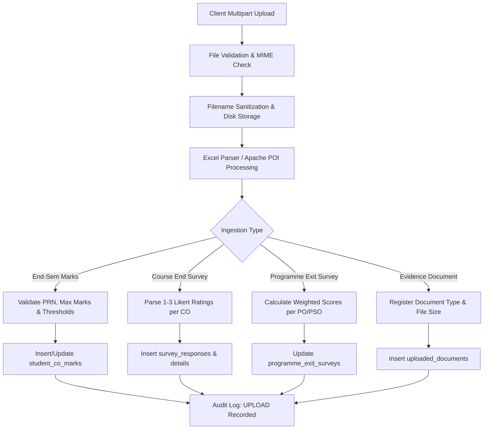
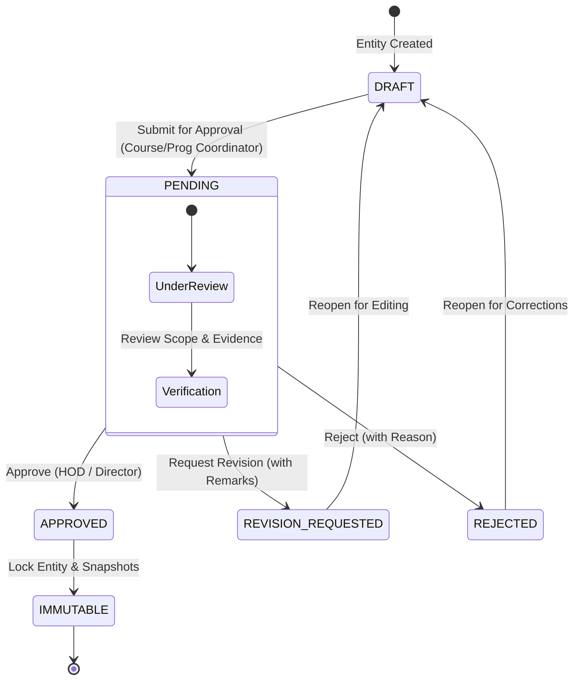
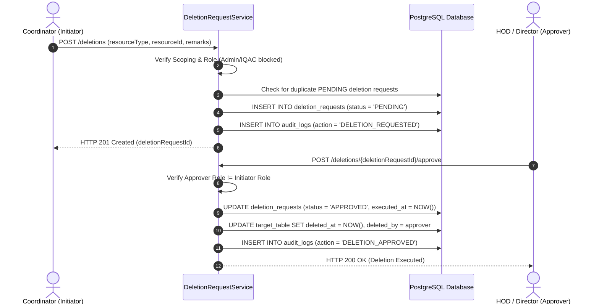
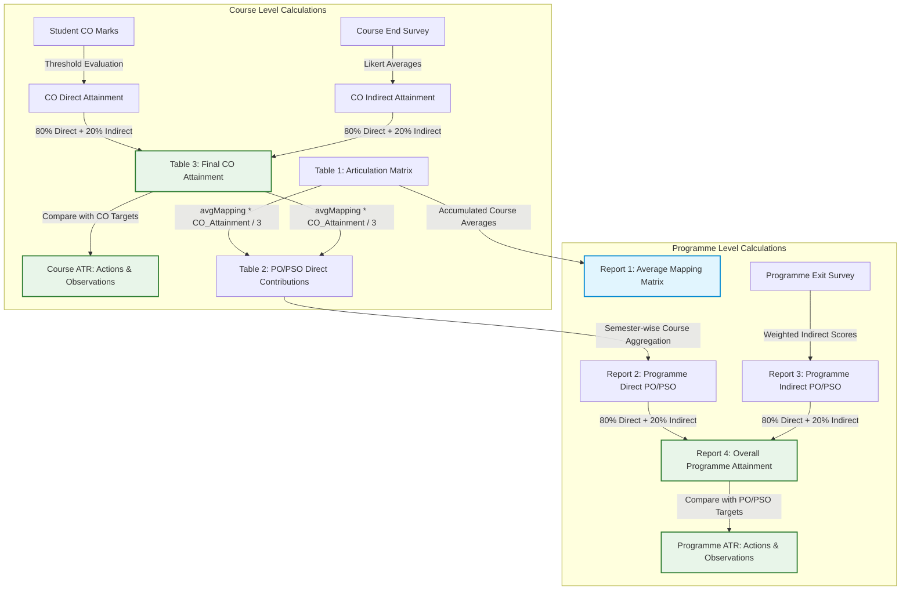
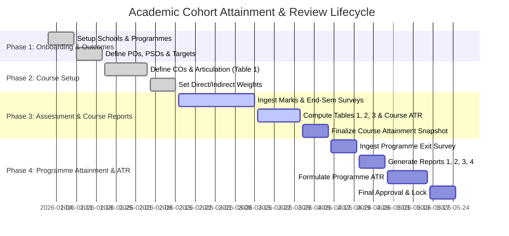

# DYPIU NBA Attainment System — Operational Workflows (`workflow.md`)

This document provides an end-to-end operational guide to the core workflows of the **DYPIU NBA Attainment System**, covering:
1. **Document Ingestion & Storage Architecture**
2. **Verification & Approval Governance (Workflow Engine)**
3. **Deletion Architecture (Two-Man Rule & Soft Deletion)**
4. **Attainment Calculation & ATR Propagation Pipeline**

---

## 1. Document Ingestion & Storage Architecture

The system supports automated ingestion of Excel spreadsheets (student marks, surveys) and arbitrary supporting evidence files (question papers, sample answer sheets, syllabi).



### 1.1 Ingestion Types & Processing Rules

1. **Student End-Semester Marks (`end_sem_marks_uploads` & `student_co_marks`):**
   - **Upload Endpoint:** `POST /programme-batch-courses/{programmeBatchCourseId}/marks/upload`
   - **File Format:** `.xlsx` / `.xls` containing headers: `PRN`, `Student Name`, `CO1`, `CO2`, `CO3`, `CO4`, `CO5`, `CO6`.
   - **Validation:**
     - Checks if student PRN exists in `students` for the cohort; if not, registers student record.
     - Validates marks $\ge 0$ and $\le \text{max\_marks}$ (default: $100.00$).
     - Computes student achievement percentage per CO.
   - **Persistence:** Creates `end_sem_marks_uploads` entry and inserts individual records into `student_co_marks`.

2. **Course End Survey (`course_end_surveys`, `survey_responses`, `survey_response_details`):**
   - **Upload Endpoint:** `POST /programme-batch-courses/{programmeBatchCourseId}/survey/upload`
   - **Rating Scale:** 1 = Slight (Low), 2 = Moderate (Medium), 3 = Substantial (High).
   - **Processing:** Normalizes student responses to compute average student satisfaction per CO.

3. **Programme Exit Survey (`programme_exit_surveys`):**
   - **Upload Endpoint:** `POST /programme-batches/{programmeBatchId}/survey/upload`
   - **File Format:** Excel sheet containing graduating student ratings for PO1–PO12 and PSO1–PSO3.
   - **Processing:** Generates percentage distributions (% Substantial, % Moderate, % Slight), computes weighted indirect scores, and outputs separated `poAttainment` and `psoAttainment` arrays.

4. **Supporting Documents & Evidence (`uploaded_documents`):**
   - **Upload Endpoint:** `POST /programme-batches/{programmeBatchId}/documents/upload`
   - **Categories (`DocumentType`):** `SYLLABUS`, `QUESTION_PAPER`, `RUBRIC`, `SAMPLE_ANSWERS`, `SURVEY_FORM`, `OTHER`.
   - **Disk Location:** Persisted under organized directory trees:
     ```
     /uploads/{category}/{programmeId}/{batchId}/{timestamp}_{sanitized_filename}
     ```

---

## 2. Verification & Approval Governance

The platform implements a centralized, multi-tiered review and approval governance engine (`approval_requests` & `approval_history`) ensuring academic data integrity and role-based validation.



### 2.1 Approval Hierarchy by Role

| Resource Type | Submitter | Reviewer / Approver | Scope Enforced |
|---|---|---|---|
| **Course Outcomes (`COURSE_OUTCOMES`)** | Course Coordinator | Programme Coordinator | `programmeBatchCourseId` |
| **CO-PO/PSO Mappings (`CO_PO_MAPPING`)** | Course Coordinator | Programme Coordinator | `programmeBatchCourseId` |
| **Attainment Config (`ATTAINMENT_CONFIG`)** | Course Coordinator | Programme Coordinator | `programmeBatchCourseId` |
| **Course ATR (`COURSE_ATR`)** | Course Coordinator | Programme Coordinator | `programmeBatchCourseId` |
| **Course Attainment Report (`COURSE_ATTAINMENT`)**| Course Coordinator | Programme Coordinator / HOD | `programmeBatchCourseId` |
| **PO/PSO Targets (`PO_PSO_TARGETS`)** | Programme Coordinator | HOD | `programmeBatchId` |
| **Course Allocations (`ALLOCATION`)** | Programme Coordinator | HOD | `departmentId` |
| **Programme ATR (`PROGRAMME_ATR`)** | Programme Coordinator | HOD / Director | `masterProgrammeId` |
| **Programme Attainment Report (`PROGRAMME_ATTAINMENT`)**| Programme Coordinator | HOD / Director | `programmeBatchId` |

### 2.2 Approved State Immutability & Reopening Policy

- **Immutability:** Once an entity status becomes `APPROVED` or `FINALIZED`, write endpoints (`POST`, `PUT`, `DELETE`) for that resource are strictly blocked with `HTTP 400 Bad Request` or `HTTP 409 Conflict`.
- **Reopening via Revision:** An approver can reject or request revision on an approval request, which resets the child entity to `DRAFT` status and enables editing.
- **Graduated Batch Editing Window:** For historical or graduated batches, an administrator or HOD can grant a time-limited editing window (`editing_window_until`), allowing temporary updates while logging every modification to the audit trail.

---

## 3. Deletion Architecture (Two-Man Rule & Soft Deletion)

To prevent accidental data loss in accredited academic structures, deletions follow a mandatory **Two-Man Rule** governed by `deletion_requests` and permanent soft-delete columns.



### 3.1 Deletion Hierarchy & Authorization Matrix

| Entity to Delete | Allowed Initiator | Required Approver | Deletion Strategy |
|---|---|---|---|
| **Programme Batch Course** | Programme Coordinator | Head of Department (HOD) | Soft delete (`deleted_at`, `deleted_by`) |
| **Programme Batch** | Head of Department (HOD) | School Director | Soft delete (`deleted_at`, `deleted_by`) |
| **Master Course** | Head of Department (HOD) | School Director | Cascade check + soft/hard delete |
| **Master Programme** | School Director | Super Admin | Restricted if active batches exist |

- **Exclusion Filter:** All read queries and calculation engines automatically filter out soft-deleted records (`WHERE deleted_at IS NULL`).
- **Cascade Safety:** Deletion of parent entities is blocked if active downstream attainment records or final reports exist.

---

## 4. Attainment Calculation & ATR Propagation Pipeline

Attainment flows from student-level scores up to university-level continuous improvement Action Taken Reports (ATRs).



### 4.1 Course Attainment Pipeline

1. **CO Direct Attainment:**
   $$\text{Student Percentage} = \frac{\text{Marks Obtained}}{\text{Max Marks}} \times 100$$
   $$\text{\% Students} \ge \text{Threshold (e.g. 60\%)} \implies \text{Mapped to Attainment Level (1, 2, or 3)}$$

2. **CO Indirect Attainment:**
   $$\text{Survey Score} = \frac{\sum \text{Ratings}}{\text{Total Respondents}} \implies \text{Normalized to 0.00 – 3.00}$$

3. **Table 3 (Final CO Attainment):**
   $$\text{Final CO Attainment} = 0.80 \times \text{Direct Level} + 0.20 \times \text{Indirect Level}$$

4. **Propagation into Course ATR (`course_atrs`):**
   - Compares $\text{Final CO Attainment}$ against $\text{Target Level}$ (default: $2.50$).
   - Computes $\% \text{ Achieved} = \frac{\text{Final CO Attainment}}{\text{Target Level}} \times 100$.
   - Identifies attainment gaps and generates mandatory continuous improvement action items.

5. **Table 2 (PO/PSO Direct Contribution):**
   For each CO mapped to $\text{PO}_j$ or $\text{PSO}_k$ with mapping level $M_{ij} \in \{1, 2, 3\}$:
   $$\text{Direct Contribution}_{j} = \frac{\text{Average Mapping}_{j} \times \text{Overall Course CO Attainment}}{3}$$

---

### 4.2 Programme Attainment Pipeline

1. **Report 1 (Average Mapping Report):**
   - Aggregates Course Table 1 mapping levels across all courses and semesters.
   - Computes semester-level average mapping and overall programme average mapping.
   - **Crucial Rule:** Report 1 is an **independent data product** and does **NOT** participate in Report 4 calculations.

2. **Report 2 (Direct Attainment Report):**
   - Aggregates Course Table 2 direct contributions across all courses in each semester for $\text{PO}_1\text{–}\text{PO}_{12}$ and $\text{PSO}_1\text{–}\text{PSO}_3$.
   - Output structured into separate `poDirectAttainment` and `psoDirectAttainment` collections.

3. **Report 3 (Indirect Attainment Report):**
   - Evaluates Programme Exit Survey feedback from graduating cohorts.
   - Output structured into separate `poIndirectAttainment` and `psoIndirectAttainment` collections.

4. **Report 4 (Overall Programme Attainment):**
   $$\text{Overall Attainment}_{\text{PO/PSO}} = 0.80 \times \text{Direct Attainment (Report 2)} + 0.20 \times \text{Indirect Attainment (Report 3)}$$

5. **Propagation into Programme ATR (`programme_atrs`):**
   - Compares each $\text{Overall Attainment}_{\text{PO/PSO}}$ against the configured Target Level (e.g. $2.50$).
   - Generates automated outcome observations:
     - If $\text{Attainment} \ge \text{Target}$: `"Target attained (X.XX >= Y.YY)"`
     - If $\text{Attainment} < \text{Target}$: `"Target not attained (X.XX < Y.YY)"`
   - Formulates action items for curriculum updates, laboratory enhancements, and pedagogical interventions.

---

## 5. End-to-End Operational Lifecycle Timeline


